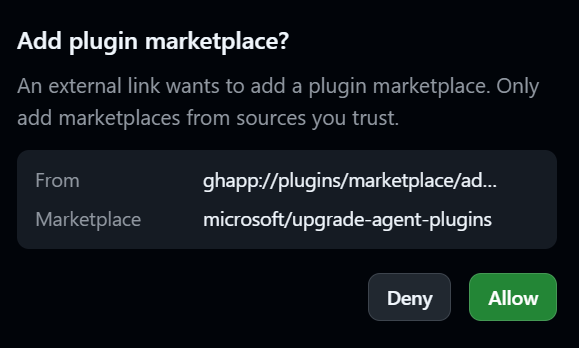
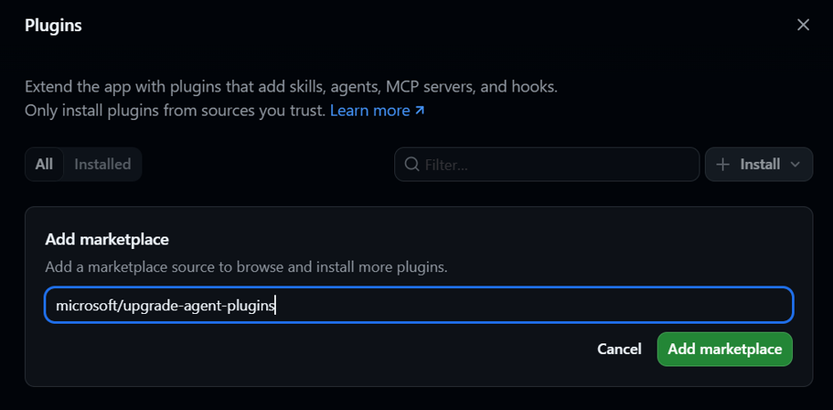
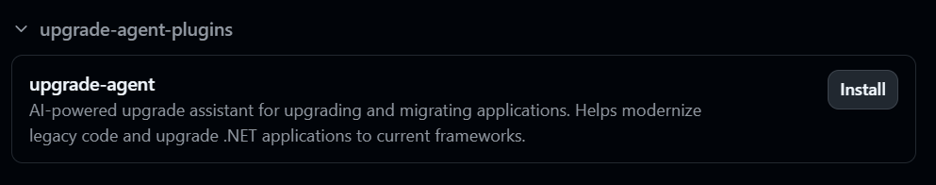
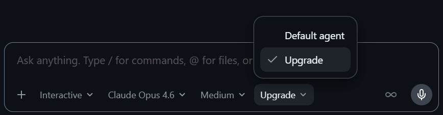

# GitHub Copilot upgrade

GitHub Copilot upgrade is an AI-powered agent that helps you upgrade applications to newer versions of languages, frameworks, and runtimes. It assesses your application, creates an upgrade plan, applies code changes, and validates the results through an interactive upgrade workflow.

## Get started

GitHub Copilot upgrade is available from both the GitHub Copilot app and GitHub Copilot CLI.

### GitHub Copilot app

[**Add this marketplace in the GitHub Copilot app →**](https://github.com/copilot/app/launch?entry_point=upgrade_agent_plugins_readme&open=ghapp%3A%2F%2Fplugins%2Fmarketplace%2Fadd%3Fsource%3Dmicrosoft%2Fupgrade-agent-plugins)

This opens the GitHub Copilot app to confirm your intention to add the marketplace: 



Once allowed, it will pre-populate the marketplace form: 



After adding the marketplace, installing the plugin is a single click from within the UI:



_Note: Prior to v1.0.3 of the GitHub Copilot app, you will need to restart the app after installing the plugin before you can use the GitHub Copilot upgrade agent._

Select the ```Upgrade``` agent from the Agent Picker:


Prompt the agent: 

```
upgrade my project to .NET 10
```

### GitHub Copilot CLI

Add the marketplace:

```javascript
/plugin marketplace add microsoft/upgrade-agent-plugins
```

Install the GitHub Copilot upgrade plugin:
```javascript
/plugin install upgrade-agent@upgrade-agent-plugins
```
Select the agent:

```/agent``` to select  ```Upgrade ```

Prompt the agent: 

```
upgrade my solution to .NET 10
```