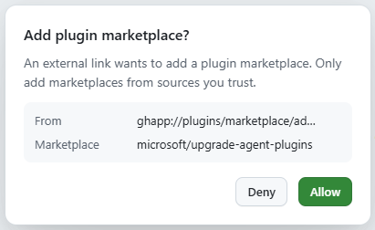
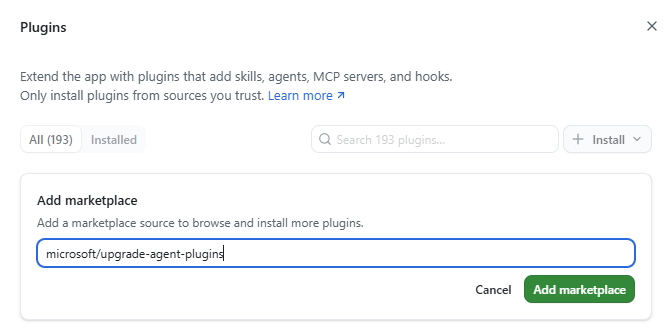
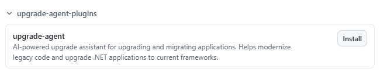

# Upgrade

A GitHub Copilot plugin marketplace for AI-assisted application upgrades — helping you upgrade, migrate, and modernize applications across languages, frameworks, and platforms.

## Install

### GitHub Copilot app

[**Add this marketplace in the Copilot app →**](https://github.com/copilot/app/launch?entry_point=upgrade_agent_plugins_readme&open=ghapp%3A%2F%2Fplugins%2Fmarketplace%2Fadd%3Fsource%3Dmicrosoft%2Fupgrade-agent-plugins)

This opens the Copilot app to confirm your intention to add the marketplace: 



Once allowed, it will pre-populate the marketplace form: 



After adding the marketplace, installing the plugin is a single click from within the UI:



_Note: Prior to v1.0.3 of the GitHub Copilot App, you will need to restart the app after installing the plugin before you can use the GitHub Copilot upgrade agent._

### Copilot CLI

Add the marketplace, then install a plugin:

```javascript
/plugin marketplace add microsoft/upgrade-agent-plugins
/plugin install upgrade-agent@upgrade-agent-plugins
```
